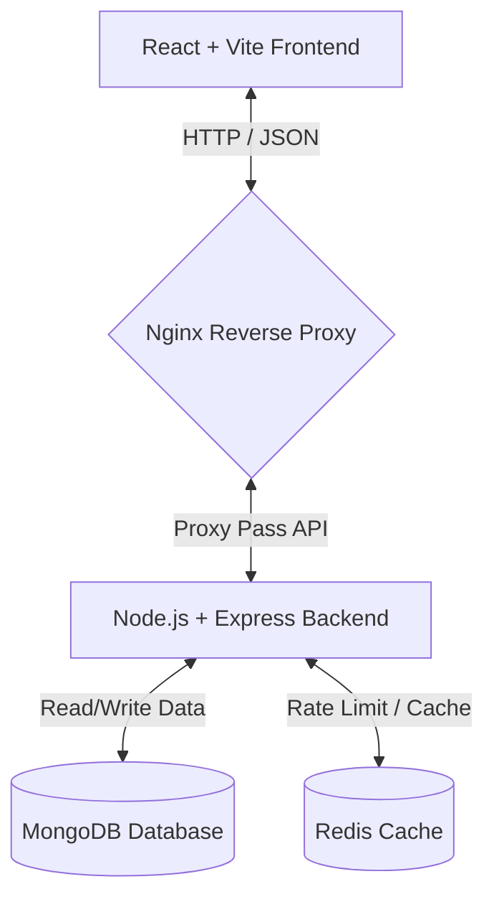

# 🚀 LinkSphere: Cloud-Native Smart URL Management Platform

LinkSphere (formerly SmartURL) is a comprehensive, enterprise-grade, cloud-native URL management platform. It allows users to create, track, customize, secure, and organize shortened links. Built on a modern multi-container architecture, LinkSphere showcases best practices in full-stack development, caching, reverse proxy configuration, containerization, and automated deployments.

---

## 📸 Architecture Overview

LinkSphere is built using a decoupled client-server architecture:



---

## 🛠️ Technology Stack

| Layer | Technologies | Key Role |
| :--- | :--- | :--- |
| **Frontend** | React, Vite, Tailwind CSS, React Router, Axios, Recharts | User Interface, Interactive Dashboards, Charts |
| **Backend** | Node.js, Express.js, Mongoose | API Gateway, MVC logic, Routing, Business Logic |
| **Database** | MongoDB | Persistent Document Store (Users, Links, Analytics) |
| **Caching / Rate Limit** | Redis | Session Caching, Hot Link Redirects, API Rate Limiting |
| **Security** | JWT, bcrypt, Helmet, Express Validator | Secure Authentication, Password Hashing, Input Sanitization |
| **Reverse Proxy** | Nginx | Load Balancing, SSL/TLS termination, Routing |
| **Containerization** | Docker, Docker Compose | Consistent Environments, Multi-container Orchestration |
| **CI/CD** | GitHub Actions | Automated linting, testing, Docker builds, and deployment |

---

## 📂 Project Structure

```text
LinkSphere/
├── client/              # React Frontend (Vite + Tailwind CSS)
├── server/              # Node.js Backend (Express + Mongoose)
├── nginx/               # Nginx Reverse Proxy Configuration
├── docker/              # Dockerfiles & deployment assets
├── docs/                # Architecture and learning documentation
├── docker-compose.yml   # Multi-container orchestration config
├── .env.example         # Environment variables template
└── README.md            # Main entry point documentation
```

---

## 👤 Features

- **Authentication**: JWT token-based auth with access and refresh tokens, forgot/reset password flow, and email verification.
- **Link Shortening**: Instant short code generation, custom aliases (e.g. `smarturl.com/custom-alias`), archive/favorite links, bulk delete, and search/filter filters.
- **Dynamic QR Code**: Generates download-ready PNG QR codes for every shortened URL.
- **Real-Time Analytics Dashboard**: Visual analytics including daily/weekly/monthly clicks, unique visitors, browser distribution, device type, OS, geolocation (country/city), and referral traffic.
- **Access Control & Security**: Password protection for specific URLs, automated link expiration dates, and custom link-deactivation.
- **Caching**: Redirection latency is minimized by caching popular links in Redis, reducing database overhead.
- **Containerized Dev & Prod**: Spin up the entire infrastructure locally or in the cloud using single Docker Compose commands.

---

## 🚦 Getting Started (Local Development)

### Prerequisites
- [Node.js](https://nodejs.org/) (v18+)
- [MongoDB](https://www.mongodb.com/) (running instance or cloud-hosted URI)
- [Redis](https://redis.io/) (running instance or cloud-hosted URL)
- *Optional:* [Docker Desktop](https://www.docker.com/products/docker-desktop/) (for containerized setup)

### Setup Steps
1. **Clone the repository:**
   ```bash
   git clone https://github.com/your-username/LinkSphere.git
   cd LinkSphere
   ```

2. **Configure Environment Variables:**
   Copy the example env file and update the variables:
   ```bash
   cp .env.example .env
   ```

3. **Install Dependencies and Run (Non-Docker):**
   - **Backend**:
     ```bash
     cd server
     npm install
     npm run dev
     ```
   - **Frontend**:
     ```bash
     cd ../client
     npm install
     npm run dev
     ```

4. **Run using Docker Compose (Recommended):**
   ```bash
   docker-compose up --build
   ```

---

## 📝 License
This project is licensed under the MIT License - see the LICENSE file for details.
