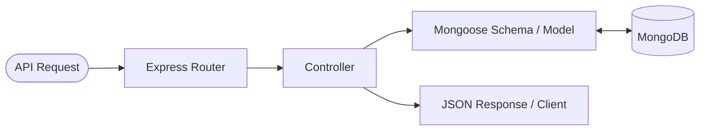

# 🏛️ LinkSphere: Architecture & Design Concepts

This document provides a detailed overview of the core software engineering principles and architectural patterns underlying the **LinkSphere** platform. Understanding these concepts is essential for navigating the codebase and contributing effectively.

---

## 1. Client-Server Architecture

LinkSphere utilizes a decoupled **Client-Server Architecture**. In this model, tasks are partitioned between the provider of a resource or service (the **Server**) and the service requester (the **Client**).

```text
+-----------------------+                    +------------------------+
|        CLIENT         |    HTTP Request    |         SERVER         |
|   (React Frontend)    | -----------------> |    (Node/Express API)  |
|                       | <----------------- |                        |
| Renders UI / Charts   |    JSON Response   | Handles Business Logic |
+-----------------------+                    +------------------------+
```

### Key Characteristics in LinkSphere:
- **Decoupled Deployment**: The frontend and backend run as separate processes (and in separate Docker containers). They communicate purely over HTTP network connections.
- **Stateless Backend**: The server does not maintain session state in-memory (e.g., sticky sessions). Each request must contain all the information necessary for processing, authenticated via JSON Web Tokens (JWT).
- **Separation of Concerns**: The frontend manages the presentation layer (UI state, routing, DOM rendering), while the backend manages data persistence, cache validation, analytics generation, and security.

---

## 2. REST APIs & HTTP Methods

Communication between LinkSphere's client and server is conducted through a **REST (Representational State Transfer) API**. REST is an architectural style that specifies design constraints for creating Web Services.

### Core Principles:
- **Resource-Oriented**: Every entity (e.g., User, URL, Analytics entry) is represented as a resource identifiable by a unique URI (e.g., `/api/v1/urls`).
- **Statelessness**: No client context is stored on the server between requests.
- **Standardized Responses**: Responses represent resources and return standard HTTP Status Codes (e.g., `200 OK`, `201 Created`, `400 Bad Request`, `401 Unauthorized`, `404 Not Found`, `500 Internal Server Error`) alongside JSON payloads.

### HTTP Methods Used in LinkSphere:

| Method | Endpoint | Action | Safe / Idempotent |
| :--- | :--- | :--- | :--- |
| **GET** | `/api/v1/urls` | Retrieve all URLs for the authenticated user | Yes / Yes |
| **GET** | `/api/v1/urls/:id` | Retrieve details of a specific URL | Yes / Yes |
| **POST** | `/api/v1/urls` | Shorten a new long URL | No / No |
| **PUT** | `/api/v1/urls/:id` | Modify/replace details of an existing URL | No / Yes |
| **DELETE** | `/api/v1/urls/:id` | Remove a URL resource | No / Yes |

---

## 3. MVC (Model-View-Controller) Pattern

To keep the backend codebase clean, maintainable, and scalable, we organize our Node.js/Express server using a variation of the **MVC Pattern**. Since our backend serves a REST API rather than HTML pages, the **View** layer is replaced by the JSON responses returned to the client.



### MVC Structure in LinkSphere (`/server`):
1. **Model (`/models`)**: Defines the data schema, validators, and database query methods using Mongoose (MongoDB ODM). Examples: `User.js`, `Url.js`, `Analytics.js`.
2. **Controller (`/controllers`)**: Contains the business logic. It reads client requests, interacts with models to read/write data, processes operations, and formats the output. Examples: `authController.js`, `urlController.js`.
3. **Router (`/routes`)**: Maps HTTP methods and URI paths to their respective controllers. Acts as the entry gate for API requests. Examples: `authRoutes.js`, `urlRoutes.js`.
4. **Middleware (`/middleware`)**: Intercepts requests before reaching the controller. Responsible for tasks like JWT token verification (`authMiddleware.js`), rate limiting, and request validation.

---

## 4. Environment Variables

**Environment Variables** allow us to decouple application configuration from the source code. This is crucial for security (keeping secrets out of version control) and environment management (dev vs. prod config).

### Best Practices Followed:
- **Never Commit Secrets**: The `.env` file containing actual passwords, database URIs, and JWT keys is added to `.gitignore` and is never committed.
- **Use Template Files**: We commit `.env.example` as a template, showing developers what configuration keys are required without revealing actual values.
- **Process Binding**: In Node.js, these are accessed securely via `process.env.VARIABLE_NAME`.
- **Twelve-Factor App Methodology**: Configuration is stored in the environment, facilitating container orchestration (Docker Compose injection) when moving from development to staging or production.

---

## 5. Git & GitHub Workflow

Version control keeps track of changes and allows multiple developers to collaborate without overwriting each other's work.

### Recommended Git Workflow for LinkSphere:

1. **Branching Strategy**: 
   - `main`: Represents stable, production-ready code.
   - `dev` or `develop`: Integration branch where features are gathered before release.
   - `feature/name-of-feature`: Short-lived branch created for a specific feature, bug fix, or task.

2. **Standard Workflow Steps**:
   ```bash
   # 1. Switch to main and pull latest changes
   git checkout main
   git pull origin main

   # 2. Create a new branch for your task
   git checkout -b feature/auth-setup

   # 3. Work on changes, then stage and commit them
   git add .
   git commit -m "feat(auth): implement registration and login controllers"

   # 4. Push branch to GitHub
   git push origin feature/auth-setup

   # 5. Open a Pull Request (PR) to merge into main / dev
   ```

3. **Writing Good Commit Messages**:
   Commit messages should be clear and prefixed to indicate intent:
   - `feat(...)`: A new user-facing feature.
   - `fix(...)`: A bug fix.
   - `docs(...)`: Documentation changes.
   - `refactor(...)`: Code cleanups that neither fix bugs nor add features.
   - `test(...)`: Adding or updating test suites.
