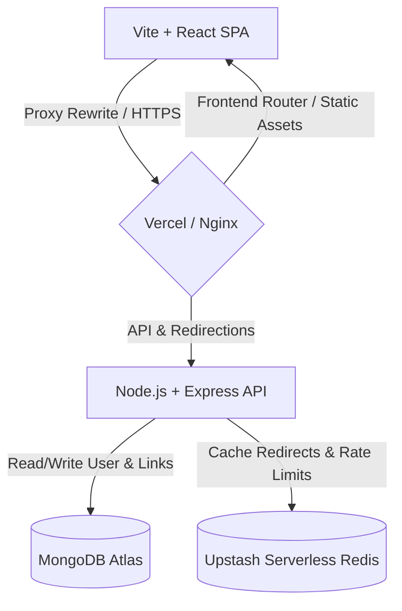

# 🎓 LinkSphere: College Project Presentation & Viva Guide

This document is designed to help you present **LinkSphere** to your college project judges and ace your viva/presentation. It covers the core concept, architecture, database design, key technical highlights, and a cheat sheet for common questions judges ask.

---

## 📢 1. Project Pitch (The "Elevator Pitch")
> *"LinkSphere is an enterprise-grade, cloud-native Smart URL Management Platform. It goes beyond simple URL shortening by offering real-time visitor analytics, dynamic QR codes, password-protected links, automatic expiration dates, API rate-limiting, and high-performance caching. The entire application is built using a modern microservices-style containerized architecture."*

---

## 🏛️ 2. Core Architecture & Tech Stack (How it Works)

Judges love diagrams and clean architecture. You can explain the data flow as a decoupled **Client-Server Architecture**:

### 🛠️ The Tech Stack Break Down:
* **Frontend:** React (v19) + Vite + Tailwind CSS + Lucide Icons + Recharts (for analytics dashboard).
* **Backend:** Node.js + Express.js + Mongoose (MongoDB ODM).
* **Caching & Rate-Limiting:** Upstash Serverless Redis (improves redirection speed and protects against DDoS).
* **Database:** MongoDB Atlas (NoSQL Document Store, chosen for flexible schema handling).
* **Hosting (Cloud):** Vercel (Frontend Edge Hosting) + Render (Backend API Service).

---

## 👤 3. Key Features to Demonstrate to Judges

When presenting, walk through these features in this order:

1. **Secure Authentication:** Standard sign-up and login with JWT (Access + Refresh token rotation) and password hashing (using `bcryptjs`).
2. **Dashboard Overview:** A summary of shortened links, favorites, and recent notifications.
3. **URL Shortening Options:** Show them that you can shorten a link with:
   - A custom alias (e.g., `/my-portfolio`).
   - A password lock (users must enter a password to redirect).
   - An expiration date (link automatically deactivates after 1, 7, or 30 days).
   - Personal notes and categorization tags.
4. **Dynamic QR Code Generation:** Downloadable QR codes generated instantly for every shortened URL.
5. **Real-time Analytics Dashboard:** Show the charts (browser, OS, device types, click timelines, and referral sources) based on visitor metadata parsing.

---

## 💾 4. Database Schema Design (NoSQL)

Explain that the system uses three core NoSQL collections:

1. **User Collection:** Stores user credentials, roles (`user`, `admin`), password reset tokens, and verification status.
2. **URL Collection:** Stores original link, shortCode, customAlias, expiration timers, password hashes (for locked links), and relations to the creator.
3. **Click Collection (Analytics):** Stores every click event, including:
   - Timestamp
   - IP address (anonymized/hashed for GDPR compliance)
   - Browser name, OS version, Device type (parsed via `ua-parser-js` header parser)
   - Referral URL (where the traffic came from)

---

## 🚀 5. Core Technical Highlights (Show off your Coding Skills!)

To get high marks, highlight these advanced engineering choices:

### A. Redis Caching for Sub-Millisecond Redirects
**Judge Question:** *"Why did you use Redis?"*
* **Your Answer:** *"Database queries are slow. When a user requests a popular link, querying MongoDB every time introduces latency. Instead, we use Redis as a caching layer. The first time a link is clicked, we fetch it from MongoDB and cache it in Redis. Subsequent clicks bypass MongoDB entirely and redirect from Redis in under 2ms, significantly reducing database load."*

### B. Security & Rate-Limiting
* **Your Answer:** *"We implemented rate-limiting middleware (`express-rate-limit` + `rate-limit-redis`) to prevent brute-force attacks and DDoS. IPs are limited to 10 authentication requests per 15 minutes to secure the login route."*
* Explain that you protect against **NoSQL Injection** (`express-mongo-sanitize`) and **Cross-Site Scripting (XSS)** (`xss`).

### C. Cookies & Cross-Site Security
* **Your Answer:** *"Access tokens are kept short-lived (15 minutes) and stored in-memory. Refresh tokens are kept in secure, `httpOnly`, `sameSite: strict` cookies, preventing them from being accessed by malicious JavaScript (XSS protection) while still supporting token renewal."*

---

## ❓ 6. Viva Cheat Sheet: Q&A for Judges

| Question | Best Answer |
| :--- | :--- |
| **Why choose MongoDB over MySQL?** | *"MongoDB's NoSQL model fits URL data perfectly. Link metadata is highly dynamic—some links have passwords, some have tags, some have expiry dates. A document store allows us to store these without empty columns or complex SQL JOINs, and makes scaling horizontal."* |
| **How do you track geographical location of a click?** | *"We capture the visitor's IP address from the request headers. Since the app is behind proxy servers (like Vercel and Nginx), we enabled `app.set('trust proxy', true)` to extract the actual client IP, which we map to location databases."* |
| **What is Vite and why use it over Create React App (CRA)?** | *"Vite is a modern build tool that uses ES modules. It is significantly faster than Webpack-based CRA because it performs on-demand compilation during development and produces highly optimized build chunks for production."* |
| **How does token rotation work?** | *"When the client's 15-minute access token expires, it silently hits `/api/v1/auth/refresh`. The server verifies the refresh token cookie, invalidates the old refresh token in MongoDB, generates a brand new access and refresh token pair, and returns it (token rotation). This ensures that if a refresh token is intercepted, it becomes useless immediately."* |
| **How did you deploy this app?** | *"We deployed it using a modern cloud-native architecture. The backend is deployed on Render, databases on MongoDB Atlas and Upstash Redis, and the frontend on Vercel. We set up proxy rewrites in Vercel to route API requests to the backend without triggering CORS issues, ensuring same-site cookie compatibility."* |
